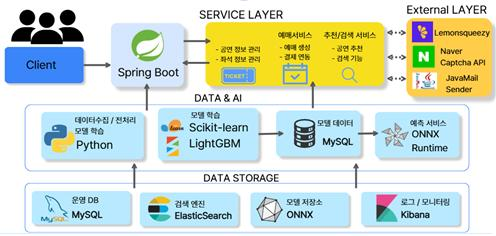

# 🎫 TicketFlow (티켓플로우)

> **"데이터와 AI로 설계하는 최적의 콘서트 예매 경험"**

TicketFlow는 공연 예매 시장의 정보 비대칭성을 해소하고, 사용자에게 데이터 기반의 의사결정을 지원하는 **콘서트 전용 통합 예매 플랫폼**입니다. 서비스의 가용성과 데이터 정합성을 보장하기 위해 캐싱 전략, 2차 검증 로직, AI 모델 경량화 등 실무 수준의 기술적 난제들을 해결하는 데 집중했습니다.

---

## 🛠 Tech Stack

### 🖥 Frontend

### ⚙️ Backend

### 📊 Data & AI

### 🚀 Infrastructure & DevTools

---

## 🏗 System Architecture

- **Layered Architecture**: Client, Service Layer, External API, Data Storage를 엄격히 분리하여 확장성과 유지보수성을 극대화하였습니다[cite: 1].
- **AI Serving**: `ONNX Runtime`을 사용하여 Python에서 학습된 LightGBM 모델을 Java 서버 내에서 직접 추론하도록 구현함으로써 네트워크 지연을 최소화했습니다[cite: 1].

---

## 🚀 Key Features

### 1. AI 기반 취소 확률 예측 서비스
- **데이터 분석**: 예매 리드타임, 유저 과거 취소율, 티켓 가격 등 주요 피처를 활용하여 모델을 학습했습니다[cite: 1].
- **성능**: 91.7%의 예측 정확도와 87.0%의 조화평균(F1-Score)을 기록하였습니다[cite: 1].
- **사용자 경험**: 사용자가 예매 진입 시 밀리초(ms) 단위로 취소 확률을 연산하여 제공함으로써 예매 전략 수립을 돕습니다[cite: 1].

### 2. 고성능 검색 엔진 (Elasticsearch)
- **자동완성**: N-gram 토크나이저와 Completion Suggester를 도입하여 실시간 검색어 자동완성을 구현했습니다[cite: 1].
- **정확도 향상**: 기존 오탐 문제를 해결하기 위해 `fuzziness` 옵션을 제거하고 `Match Phrase` 쿼리 기반으로 로직을 개선하여 검색 품질을 안정화했습니다[cite: 1].

### 3. 결제 정합성 보장
- **Webhook 2차 검증**: 결제 완료 직전, 서버단에서 좌석의 점유 유효성을 한 번 더 교차 검증하여 지각 결제를 차단합니다[cite: 1].
- **자동 환불**: 무효 처리된 결제 건은 관리자 개입 없이 100% 자동 전액 환불 및 안내 메일이 발송되는 파이프라인을 구축했습니다[cite: 1].

---

## ⚠️ Troubleshooting (기술적 난관 극복)

| 문제 상황 | 원인 분석 | 기술적 해결책 |
| :--- | :--- | :--- |
| **지각 결제(중복 예매)** | 외부 결제 모듈과 서버 간 제어권 분리 | **Webhook 2차 검증** 및 자동 환불 처리[cite: 1] |
| **서버 마비 위험** | 다수 유저의 새로고침으로 인한 AI 연산 부하 | **Caffeine Cache** 도입 (결과 10분 캐싱)[cite: 1] |
| **검색 결과 오탐** | 검색어 오타 허용 범위가 너무 넓게 설정됨 | **Match Phrase** 쿼리 전환[cite: 1] |
| **서버 실행 지연** | 공연 데이터 건별 전송(PUT)에 따른 통신 오버헤드 | **Bulk API** 전환으로 통신 비용 제거[cite: 1] |

---

## 👥 팀원 및 수행 역할
- **조민영**: 공연 데이터 수집 및 정제, Elasticsearch 검색 엔진 구현, 예매 통계 실시간 시각화[cite: 1].
- **서승진**: Lemon Squeezy 결제 파이프라인 및 자동 환불 로직, AI 예매 취소 확률 예측 모델링[cite: 1].
- **한승현**: 좌석 선점 알고리즘, 공연 회차 선택 시스템, 예매율 예측 로직 구현[cite: 1].

---

## 🌐 프로젝트 링크
- **서비스 바로가기**: [https://ticket-flow.shop/](https://ticket-flow.shop/)
